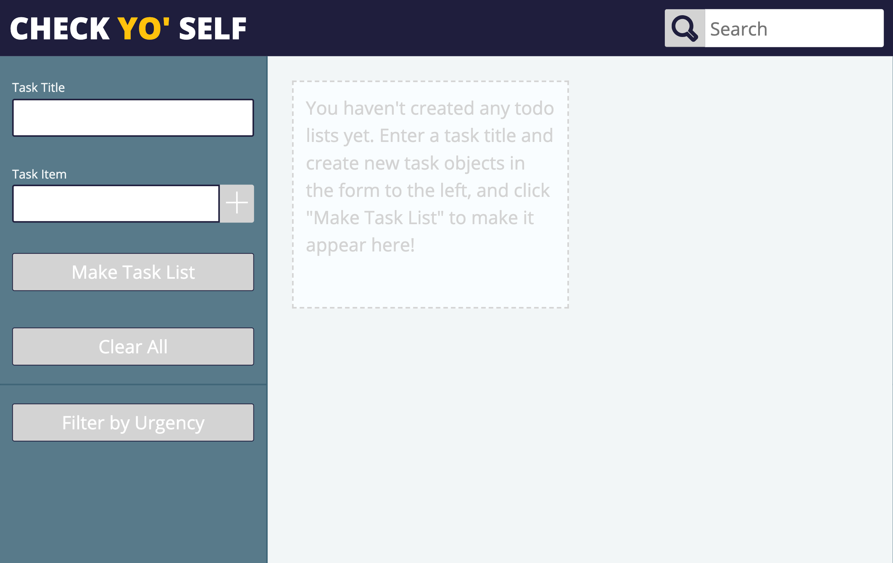
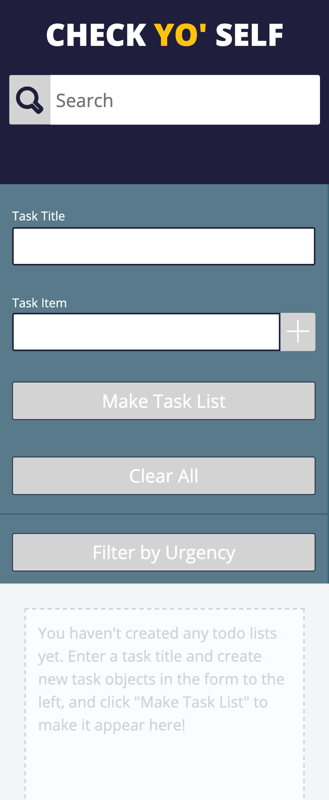

# CheckYoSelf

## Author
Eric O'Neill

## Overview
CheckYoSelf is an app that is designed to allow users to create todo lists for themselves.

Users can mark tasks as urgent to know which ones to complete first, and can click the "Filter By Urgency" button to only display todos that they have marked as urgent.

Users can also use the search bar in the top right-hand search bar to filter their todos by their titles.

Once a user has checked off each task on a given todo list, they are able to delete that todo list.

## Screenshots
### Full Screen

### Mobile Layout
